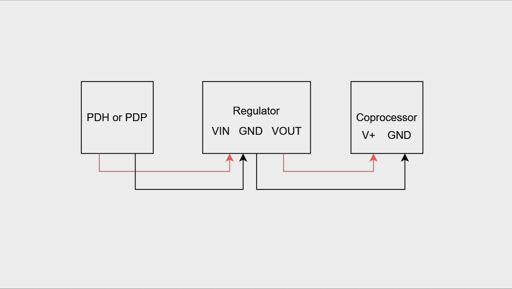

# Configuration

This part of the guide provides a quick and concise tutorial on how to wire, configuring network, and do basic configurations with a coprocessor with already installed PhotonVision. If the coprocessor has not yet installed PhotonVision server, continue to [Installation](./Configuration.md) instead.

## Wiring

The Wiring section includes basic wiring information for the coprocessor with RIO and the camera.

It is generally recommended to connect the coprocessor to the roboRIO via wired connection as it is more stable than other means. This practice also recommended in [WPILib's Wiring Documentation] as well as [PhotonVision's].

### Prerequisites

- Network Switch (strongly recommended)
- Ethernet Cables with adequate lengths
- CTRE Voltage Regulator Module (or other voltage regulators to your likings)

### Wiring Diagram

The following is the wiring diagram from PhotonVision. It is also advised to power your network switch in the same manner.

A complete wiring diagram from WPI Lib can be found [here](https://docs.wpilib.org/en/stable/_images/vision-code-on-a-coprocessor.drawio1.svg)

For an older version of Pi computers, power is supplied over a MicroUSB port (5V1~2A). For a newer version of Pi such as Orange Pi 5B, power is supplied via a USB-C port with maximum power of 5V4A. In both cases, you can either use a pigtail wire with USB-C/MicroUSB port or simply strip-open a power cable. Design your wiring paths and power distribution wisely to avoid sudden power outage or current overcharge.

It is not advised to directly use the second ethernet port of the robot radio as it is known to be buggy (even buggier than the first one). You will need stable voltage and ampere for both your network switch and coprocessor. For appropriate powering of the coprocessor, see respective coprocessor's user manual.

[PhotonVision's]:<https://docs.photonvision.org/en/latest/docs/installation/wiring.html>

[WPILib's Wiring Documentation]: <https://docs.wpilib.org/en/stable/docs/software/vision-processing/wpilibpi/using-a-coprocessor-for-vision-processing.html>

## Connection

The Connection section includes the configurations to be made in order to connect the coprocessor to roboRio and NetworkTables, in other words, code-integration-ready.

**IMPORTANT**: **DO NOT** proceed from here if you have not yet complete the `Wiring` section. The following contents are dependant to the previous sections(s).

### Connecting to the Coprocessor

After proper wiring and ensure that the coprocessor boots with PhotonVision while ensuring the ethernet connection is appropriately established. To verify the wired connection, you can try typing `nmtui` command on the coprocessor.

After verifying ethernet connection, connect your computer to the robot's WiFi and try visiting <photonvision.local:5800> in your browser.

If local DNS fails to parse the URL, try using an IP scanner such as [Angry IP Scanner](https://angryip.org). Should the roboRIO be configured properly, the IP address of the coprocessor should be within the range 10.TE.AM.0 ~ 10.TE.AM.255, where TE and AM are the two-digits components to the 4-digit team number.

*Note: if your team number is not a 4-digit number, pay attention to your roboRIO's IP, since roboRIO by default has IP with pattern 10.TE.AM.2. Replace the digits to your need.*

### Networking Setup

Open PhotonVision's dashboard and navigate to the `Settings` page `Networking` section and begin the following configuration.

- Set team number (this ensures connection to the NetworkTables)
- Change IP Assignment Mode to static, and set the IP address to 10.TE.AM.11. (this ensures PhotonVision's accessability over robot code)

Upon completion, click `Save` and power cycle your robot. After reboot, you should be able to connect to PhotonVision's dashboard at <http://10.TE.AM.11:5800>
